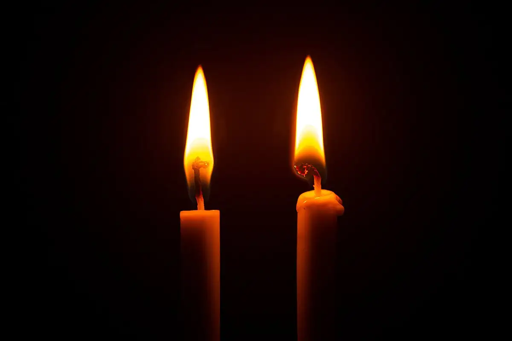
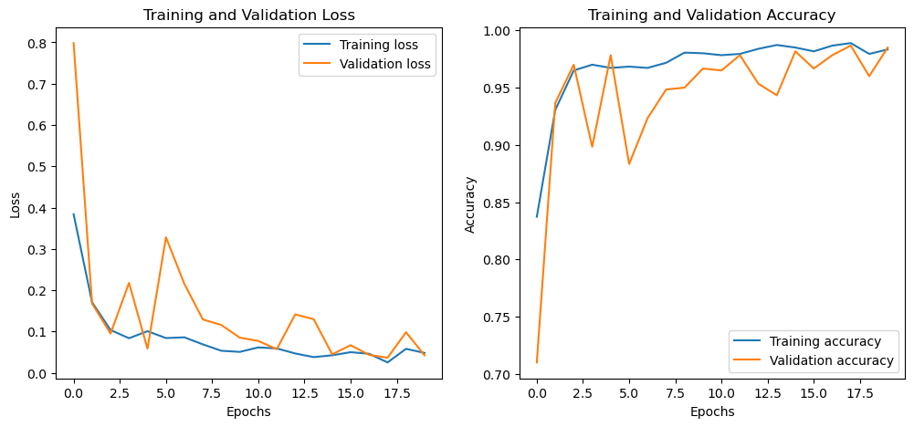
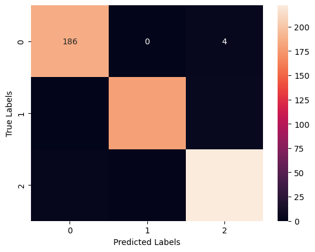
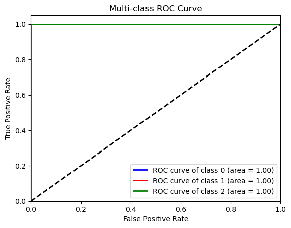
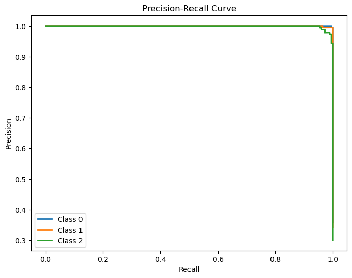
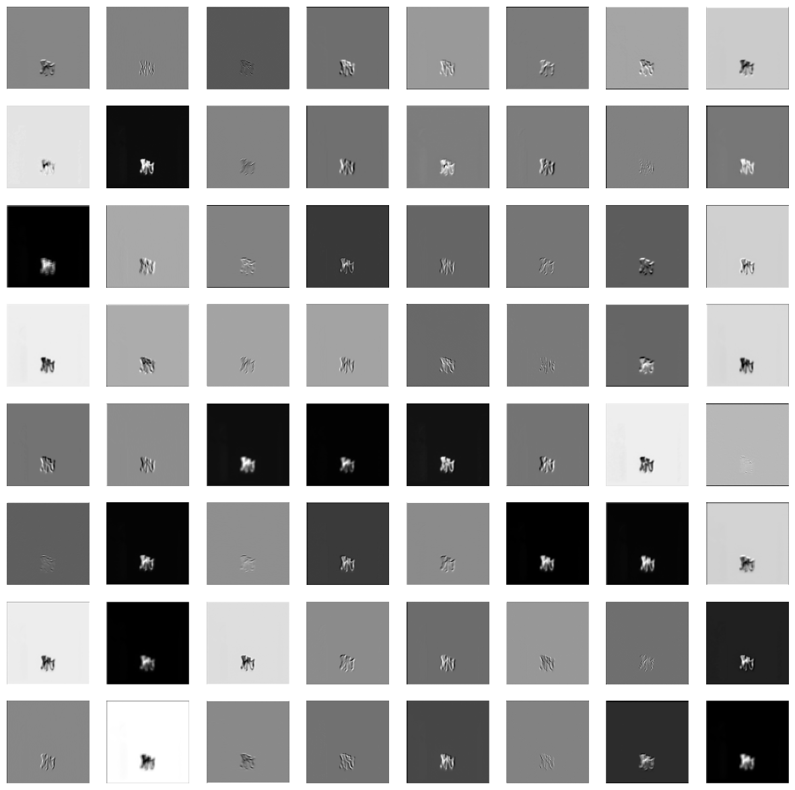
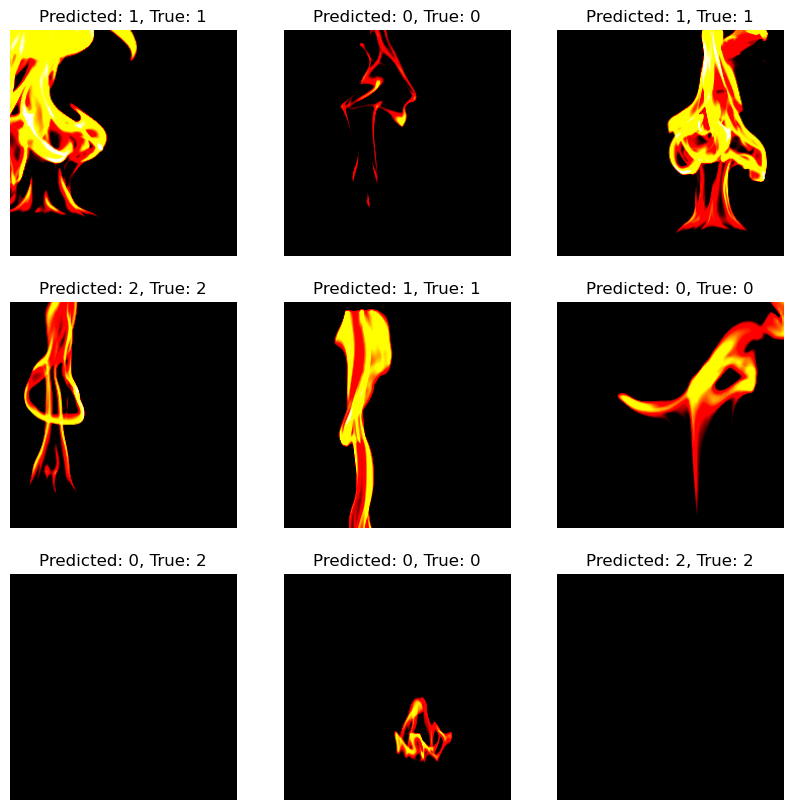
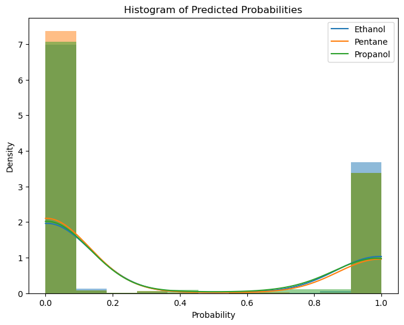

# Burning Liquid Image Classification

## Overview
The objective of this project is to develop a neural network-based model capable of classifying images of flames into three categories: ethanol, pentane, and propanol. This classification task is crucial for understanding the characteristics and properties of different types of flames, which has practical applications in fields like fire safety, combustion research, and material testing. The project utilizes the ResNet-34 architecture, a pre-trained model, and leverages transfer learning to the specific task of flame classification.

## Dataset
Download the burning liquid dataset from https://doi.org/10.1007/s10973-021-10903-2 – Supplementary Information, File #2. The dataset consists of 3000 hi-resolution flame images of burning ethanol, pentane, and propanol. Extract the images into a data folder. Then split the images into subfolders named ethanol, pentane, and propanol based on their filename.

## Data Preparation
The dataset consists of images of three types of flames. These images undergo a series of preprocessing steps, including resizing, normalization, and augmentation (like random horizontal flipping) to make the model robust and improve its ability to generalize.

## Model Architecture 
The project utilizes the ResNet-34 architecture, a pre-trained model known for its efficacy in image classification tasks. This approach leverages transfer learning, where a model trained on a large dataset (ImageNet) is fine-tuned to the specific task of flame classification.

## Data Visualization
### Loss Value and Accuracy Rate per Epoch (Train and Validation sets)

### Confusion Matrix

### ROC Curve

### Percision_Recall Curve Curve

### Layer Visualization
Each plot represents the activations captured by a different filter in the layer. These activations highlight different features of the image, like edges, textures, or patterns, depending on what each filter has learned to detect.

## Results
After training the model for 20 epochs, the model achieves an accuracy rate of 98% 

### Sample Predictions

### Histogram of Predicted Probabilities

## Conclusion
The project successfully demonstrates the application of deep learning in classifying flame images. The use of a pre-trained model and advanced techniques like progressive unfreezing shows promising results. I hope you find it useful. Please let me know if you have any feedback or questions.
